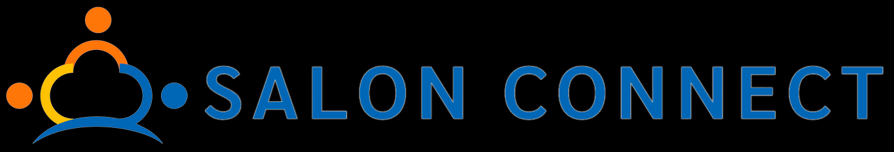

# 🎉 SalonConnect

<p align="center">
  
</p>

<p align="center">
  <strong>Sistema de gestão para salões de festas</strong>
</p>

<p align="center">
  Organização, automação e praticidade em um único lugar.
</p>

<p align="center">
  <a href="https://salonconnect-ypz0.onrender.com" target="_blank">
    🌐 Acessar o SalonConnect
  </a>
</p>

---

## 📌 Sobre o projeto

O **SalonConnect** é uma plataforma web desenvolvida para facilitar a gestão de salões de festas.

A ideia surgiu a partir da necessidade de substituir processos manuais, planilhas e anotações espalhadas por diferentes lugares por um sistema centralizado, moderno e de fácil utilização.

O sistema reúne em um único ambiente recursos para gerenciamento de **clientes, eventos, agenda, contratos, estoque e controle financeiro**, permitindo que o responsável pelo salão tenha uma visão mais organizada do negócio.

O projeto também conta com uma área comercial, permitindo simular a escolha de planos, cadastro de um novo salão e o fluxo de contratação do sistema.

---

## 🎯 Objetivo

O principal objetivo do SalonConnect é **centralizar e automatizar a gestão de salões de festas**, reduzindo processos manuais e facilitando o acompanhamento das informações do negócio.

A plataforma busca ajudar o responsável pelo salão a:

* Organizar seus eventos;
* Cadastrar e consultar clientes;
* Criar e gerenciar contratos;
* Acompanhar pagamentos;
* Controlar o estoque;
* Visualizar informações financeiras;
* Gerenciar funcionários e permissões;
* Obter uma visão geral do negócio através do dashboard.

---

## 🚀 Funcionalidades

### 📊 Dashboard

Painel principal com uma visão geral das informações do salão.

Possibilita acompanhar:

* Eventos;
* Contratos;
* Informações financeiras;
* Clientes;
* Estoque;
* Indicadores do negócio.

---

### 📅 Agenda

Sistema para organização dos eventos do salão.

Permite visualizar os compromissos e acompanhar a agenda de eventos de maneira mais organizada.

---

### 👥 Clientes

Módulo para gerenciamento dos clientes.

Permite:

* Cadastro de clientes;
* Consulta de informações;
* Organização dos dados;
* Utilização dos dados no processo de criação dos contratos.

---

### 📄 Contratos

O sistema possui recursos para criação e gerenciamento de contratos.

Entre as funcionalidades estão:

* Criação de novos contratos;
* Cadastro das informações do evento;
* Registro dos dados do cliente;
* Controle de valores;
* Controle de pagamentos;
* Consulta de contratos salvos;
* Geração de documentos.

---

### 💰 Controle financeiro

Permite acompanhar as informações financeiras relacionadas aos contratos e eventos.

O sistema consegue identificar situações como:

* Contratos quitados;
* Pagamentos parciais;
* Pagamentos pendentes;
* Valores recebidos;
* Valores restantes.

---

### 📦 Controle de estoque

O SalonConnect possui um módulo específico para controle de estoque.

Entre os recursos estão:

* Cadastro de produtos;
* Quantidade disponível;
* Valor dos produtos;
* Controle de utilização;
* Previsão de itens necessários para os eventos;
* Registro de consumo;
* Acompanhamento dos gastos.

O sistema também permite relacionar o estoque com os eventos cadastrados, facilitando a previsão dos produtos necessários para cada festa.

---

### 👨‍💼 Funcionários e permissões

O sistema permite trabalhar com diferentes usuários e permissões.

É possível controlar o acesso a áreas como:

* Dashboard;
* Agenda;
* Contratos;
* Estoque;
* Financeiro;
* Funcionários;
* Relatórios;
* Configurações.

---

### 📑 Relatórios

O sistema possui recursos para geração e visualização de informações relacionadas aos eventos e ao funcionamento do salão.

Também existe a possibilidade de gerar documentos em PDF com informações relacionadas aos eventos e utilização de estoque.

---

### 🤖 Assistente virtual

O SalonConnect possui um assistente virtual integrado à plataforma.

O assistente pode responder perguntas relacionadas ao sistema, como:

> "Quais são os planos?"

> "Quais são os preços?"

> "Qual é o plano mais popular?"

> "Como faço para contratar?"

> "O que é o SalonConnect?"

> "O controle de estoque está disponível?"

Além disso, o assistente fornece informações sobre os recursos disponíveis em cada plano.

---

## 💳 Planos

O projeto possui uma área comercial com planos diferentes para atender diferentes tipos de salões.

### 🟢 Plano Essencial

Indicado para pequenos salões que desejam começar a organizar sua gestão.

**Recursos:**

* Cadastro de clientes;
* Agenda de eventos;
* Controle de orçamentos;
* Registro básico de contratos.

---

### 🔵 Plano Profissional

Indicado para salões que desejam ampliar o controle sobre o negócio.

**Recursos:**

* Recursos do Plano Essencial;
* Controle financeiro;
* Geração de contratos;
* Relatórios;
* Controle de eventos;
* Controle de estoque.

---

### 🟠 Plano Avançado

Voltado para uma gestão mais completa.

**Recursos:**

* Recursos do Plano Profissional;
* Controle de estoque;
* Multiusuários;
* Funcionários;
* Relatórios avançados;
* Configurações adicionais.

---

## 💳 Simulação de contratação

O projeto também possui um fluxo de contratação para demonstrar como seria a experiência de um cliente adquirindo o sistema.

O fluxo permite:

1. Escolher um plano;
2. Cadastrar o salão;
3. Informar os dados necessários;
4. Selecionar uma forma de pagamento;
5. Simular o pagamento;
6. Registrar as informações no sistema.

> **Observação:** o ambiente de pagamento é uma simulação para fins de demonstração e desenvolvimento.

---

## 🛠️ Tecnologias utilizadas

### Front-end

* HTML5
* CSS3
* JavaScript
* Google Fonts
* Poppins

### Back-end

* Python
* Flask
* SQLAlchemy

### Banco de dados

* SQLite

### Geração de documentos

* ReportLab
* PDF

### Versionamento e deploy

* Git
* GitHub
* Render

---

## 🏗️ Estrutura do projeto

```text
SalonConnect/
│
├── static/
│   ├── css/
│   │   └── style.css
│   │
│   ├── js/
│   │   └── script.js
│   │
│   └── img/
│       ├── logo.png
│       ├── logo_preto_hor.png
│       └── ...
│
├── templates/
│   ├── index.html
│   ├── admin.html
│   ├── agenda.html
│   ├── contratos.html
│   ├── estoque.html
│   ├── financeiro.html
│   ├── funcionarios.html
│   ├── relatorios.html
│   ├── configuracao.html
│   ├── novo_contrato.html
│   ├── novo_salao.html
│   └── ...
│
├── instance/
│   └── salonconnect.db
│
├── app.py
├── criar_tabela.py
├── requirements.txt
└── README.md
```

---

## 🗄️ Banco de dados

O projeto utiliza **SQLite** como banco de dados.

Entre as principais entidades utilizadas pelo sistema estão:

* Usuários;
* Salões;
* Permissões;
* Orçamentos;
* Configurações de contratos;
* Contratos;
* Estoque;
* Informações financeiras.

A utilização do SQLAlchemy facilita a comunicação entre a aplicação Flask e o banco de dados.

---

## 🔐 Autenticação

O sistema possui uma área de login para acesso ao ambiente administrativo.

Após a autenticação, o sistema identifica o tipo de usuário e direciona para a área correspondente.

Também são utilizadas permissões para controlar quais funcionalidades podem ser acessadas por cada usuário.

---

## 🖥️ Interface

A interface do SalonConnect foi desenvolvida buscando manter uma experiência simples e intuitiva.

O projeto utiliza:

* Design responsivo;
* Menu adaptado para dispositivos móveis;
* Cards;
* Modais;
* Dashboards;
* Formulários;
* Calendários;
* Componentes interativos;
* Identidade visual própria.

A interface utiliza principalmente a fonte **Poppins** e uma identidade visual baseada em tons claros, preto e laranja.

---

## 📱 Responsividade

O sistema foi desenvolvido considerando diferentes tamanhos de tela.

A interface possui adaptações para:

* 💻 Computadores;
* 💻 Notebooks;
* 📱 Smartphones;
* 📱 Tablets.

---

## 🌐 Demonstração

Você pode acessar a versão online do projeto através do link:

### 👉 [Acessar o SalonConnect](https://salonconnect-ypz0.onrender.com)

O ambiente online foi disponibilizado através do **Render** para demonstração da aplicação.

---

## 🎥 Demonstração do sistema

Algumas das funcionalidades que podem ser demonstradas:

* Página inicial;
* Escolha de planos;
* Cadastro de salão;
* Login;
* Dashboard;
* Agenda;
* Cadastro de clientes;
* Contratos;
* Controle financeiro;
* Controle de estoque;
* Relatórios;
* Assistente virtual.

---

## 📸 Telas do sistema

### Página inicial


### Agenda


### Contratos


### Estoque


### Assistente virtual


---

## 📚 Contexto acadêmico

O SalonConnect também foi desenvolvido como projeto acadêmico durante a graduação em **Sistemas de Informação**.

Durante o desenvolvimento foram aplicados conhecimentos relacionados a:

* Desenvolvimento de sistemas;
* Desenvolvimento web;
* Banco de dados;
* Engenharia de software;
* Modelagem de dados;
* Desenvolvimento de APIs;
* Interface e experiência do usuário;
* Controle de versões;
* Deploy de aplicações;
* Automação de processos.

O projeto também serviu como oportunidade para transformar um problema real de gestão em uma solução tecnológica.

---

## 💡 Problema identificado

A gestão de um salão de festas pode envolver diversas informações simultaneamente:

* Clientes;
* Datas de eventos;
* Contratos;
* Pagamentos;
* Funcionários;
* Produtos;
* Estoque;
* Orçamentos.

Quando essas informações são controladas através de cadernos, planilhas ou sistemas separados, aumenta a possibilidade de erros e perda de informações.

O SalonConnect foi desenvolvido com a proposta de **centralizar essas informações em uma única plataforma**.


## 📈 Evolução do projeto

O SalonConnect foi desenvolvido de forma incremental, passando por diferentes etapas até chegar à versão atual.

O projeto começou com a ideia de automatizar tarefas de gestão e evoluiu para uma plataforma web completa, envolvendo:

**Planejamento → Desenvolvimento → Banco de dados → Interface → Integração → Testes → Deploy**

Essa evolução permitiu transformar uma ideia inicial em uma aplicação funcional disponível online.

---

## 👨‍💻 Desenvolvedor

Projeto desenvolvido por **Kaio**, estudante de **Sistemas de Informação**, com foco em desenvolvimento de sistemas e aplicações web.

---

## 📄 Licença

Este projeto foi desenvolvido para fins acadêmicos, profissionais e de demonstração.

---

## ⭐ Considerações finais

O **SalonConnect** representa a aplicação prática de conhecimentos de desenvolvimento de software em um problema real de negócio.

A proposta é tornar a gestão de salões de festas mais organizada, eficiente e acessível através da tecnologia.

---

<p align="center">
  <strong>SalonConnect</strong><br>
  Gestão inteligente para salões de festas.
</p>

<p align="center">
  🌐 <a href="https://salonconnect-ypz0.onrender.com">Acessar sistema</a>
</p>
